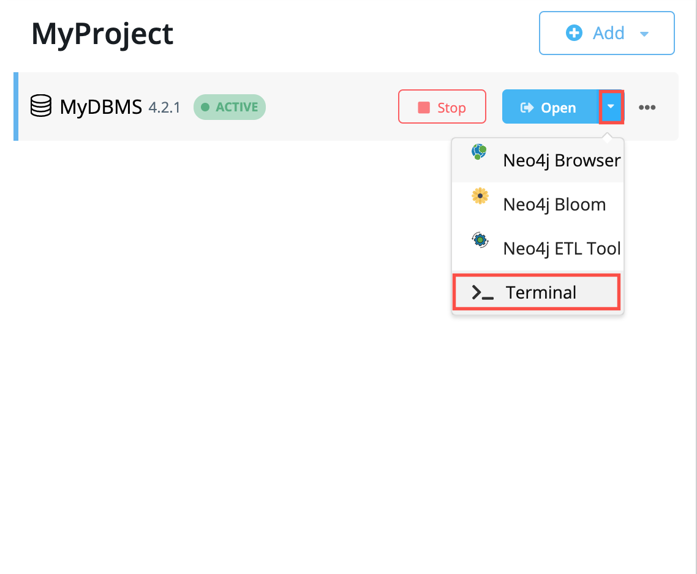

# Neo4J Desktop en mode terminal



## Exporting the cypher database

```bash
time ./bin/cypher-shell -u neo4j -p andrea "call apoc.export.cypher.all('import/exportDataCypherShellParams.cypher',{format:'cypher-shell', useOptimizations: {type: 'unwind_batch_params', unwindBatchSize:100}})"
```

## Importing the cypher database

```bash
time ./bin/cypher-shell -u neo4j -p andrea < 'import/exportDataCypherShellParams.cypher' > 'import/output.exportDataCypherShellParams.log'
```

---

Sources:

- https://neo4j.com/developer/desktop-csv-import/#loadcsv-desktop
- https://medium.com/neo4j/efficient-neo4j-data-import-using-cypher-scripts-7d1268b0747
- https://neo4j.com/developer-blog/updated-efficient-neo4j-data-import-using-cypher-scripts/
- https://stackoverflow.com/questions/54224244/loading-large-cypher-file-in-neo4j

# Optimization related to my setup

> first tips: You should one map with all your parameters 
> and if you do a MERGE only use the unique property (properties) in the merge statement and further SET the other properties 
> If you have a Map with parameters then you can give a list of maps as a query parameter and do an unwind. 
> From which environment do you create the .cypher file?
> Maybe you can use a bolt connector from that environment to fire cypher statements to the database 
